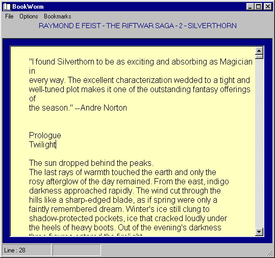



## BookWorm \- Electronic Book Viewer with bookmarks, Color changes for easy on the eys reading\.

### Description

This is an Electronic book Viewer. It supports rtf and txt, not .lit and .pdf formats. The reason why I wrote this is that I found a lot of Fantasy Books at http://21ct.gooddays.org/books.html and started reading them in Wordpad/Notepad. That proved difficult, so I created this program to allow me to read the text as close as possible to Micro$oft's MSREADER. You can change font size, set bookmarks,change the fore color, back color, margins etc etc. I use it and it works form me. If you like it, please vote or at least leave a comment. If you don't like it, tell my why so I can inprove. I included one of Raymond E Feists books for you to test the app with. Enjoy !!! - I added experimental adware code...
 
### More Info
 

             |
---                |---
**Submitted On**   |2001-06-19 11:34:54
**By**             |[N/A](https://github.com/Planet-Source-Code/PSCIndex/blob/master/ByAuthor/empty.md)
**Level**          |Intermediate
**User Rating**    |4.4 (40 globes from 9 users)
**Compatibility**  |VB 5\.0, VB 6\.0
**Category**       |[Complete Applications](https://github.com/Planet-Source-Code/PSCIndex/blob/master/ByCategory/complete-applications__1-27.md)
**World**          |[Visual Basic](https://github.com/Planet-Source-Code/PSCIndex/blob/master/ByWorld/visual-basic.md)
**Archive File**   |[BookWorm \-213916202001\.zip](https://github.com/Planet-Source-Code/bookworm-electronic-book-viewer-with-bookmarks-color-changes-for-easy-on-the-eys-reading__1-24240/archive/master.zip)

